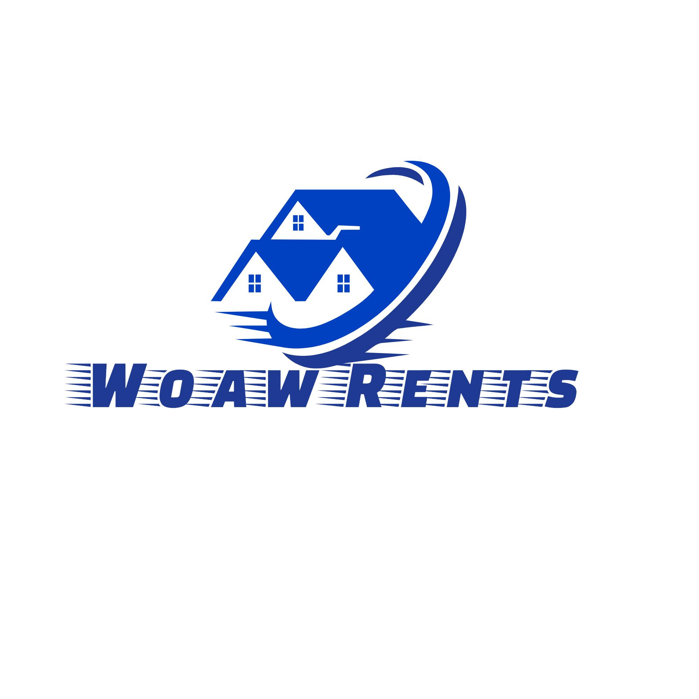

## About Laravel

Une Application web dévélopé aved le framework Laravel. Son but est de faciliter la
tache a toute personnes qui est a la recherche d’un logement au Cameroun en mettant ses données qui
consistent d’un vaste nombre de logement de tout types et catégories sur tout l’étendue du territoire
Camerounais a leur disponibilité. Elle offre aussi un espace de publicité pour ceux qui détiennent des
terrains et autre biens immobiliers a vendre
.

## Contributing

Thank you for considering contributing to WoawRents Development! The contribution guide can be found in the ....

## Code of Conduct

## Security Vulnerabilities

If you discover a security vulnerability within WoawRent, please send an e-mail to Chinda Jordan via [jstar.divinio@gmail.com](mailto:jstar.divinio@gmail.com). All security vulnerabilities will be promptly addressed.

## License

WoawRents
